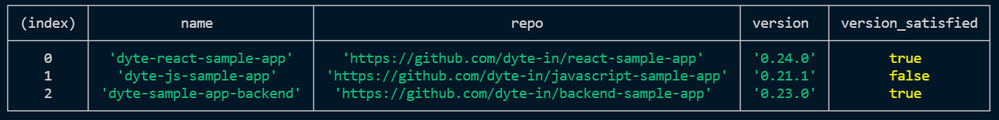
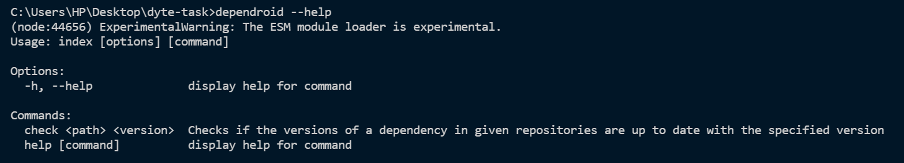
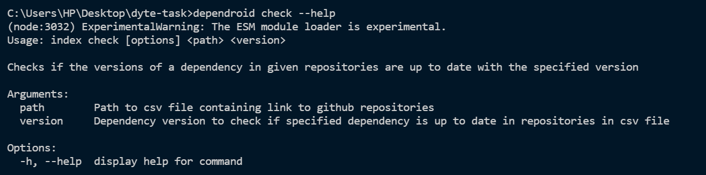
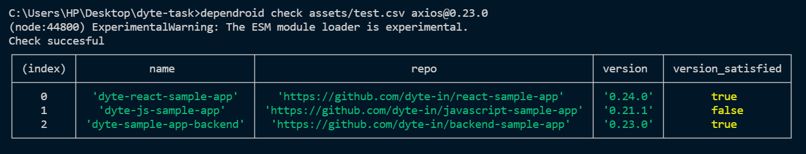

<!-- PROJECT LOGO -->
<br />
<div align="center">
  


<h3 align="center">DepenDroid</h3>

  <p align="center">
   A CLI tool that takes a list of Github repositories (assuming all of them are node js projects with a package.json and package-lock.json in the root) and the name and version of a dependency, and returns the current version of that dependency and tells if the version is greater than or equal to the version specified or not.
    <br />
  </p>
</div>


<!-- TABLE OF CONTENTS -->
<details>
  <summary>Table of Contents</summary>
  <ol>
    <li>
      <a href="#about-the-project">About The Project</a>
      <ul>
        <li><a href="#built-with">Built With</a></li>
      </ul>
    </li>
    <li>
      <a href="#getting-started">Getting Started</a>
      <ul>
        <li><a href="#prerequisites">Prerequisites</a></li>
        <li><a href="#installation">Installation</a></li>
      </ul>
    </li>
    <li><a href="#usage">Usage</a></li>
    <li><a href="#license">License</a></li>
  </ol>
</details>


<!-- ABOUT THE PROJECT -->
## About The Project

DependDroid eases the process of checking and updating dependencies in multiple repositories. It fetches the `package.json` file of given git repositories and compares their dependency version with the specified one. It also displays the current versions and a boolean value representing whether the dependencies need an update, as output.



### Built With


* [Node.js](https://nodejs.org/)

<!-- GETTING STARTED -->
## Getting Started

### Prerequisites

Make sure your npm is up to date.
* npm
  ```sh
  npm install npm@latest -g
  ```

### Installation

1. Clone the repo
   ```sh
   git clone https://github.com/dyte-submissions/dyte-vit-2022-Ishan-001.git
   ```
2. Install NPM packages
   ```sh
   npm install
   ```
3. Install the tool on your machine
   ```js
   npm i -g
   ```
   Now the tool is ready to be run in terminal

<!-- USAGE EXAMPLES -->
## Usage

DepenDroid comes with two commands - `check` and `update` (under development). You can use the `help` command to view the tool details.
<br>


<br>

Both the commands can be viewed in detail using ``dependroid <command> --help``
<br>


<br>

The `check` command needs to be supplied two arguments - `path_to_csv` and `dependency_version`. The csv file is parsed using `jsontocsv` library and `package.json` from each repository is fetched using `request`. Versions are compared using `compare-versions` library.

The following line of code can be used to test the `check` command.

```sh
dependroid check assets/test.csv axios@0.23.0
```



<!-- LICENSE -->
## License

Distributed under the MIT License. See `LICENSE.txt` for more information.


<!-- CONTACT -->
## Contact

Ishan Khandelwal - [@twitter](https://twitter.com/@_ishawn_) - axil.ishan3@gmail.com

<p align="right">(<a href="#top">back to top</a>)</p>


<!-- MARKDOWN LINKS & IMAGES -->
<!-- https://www.markdownguide.org/basic-syntax/#reference-style-links -->
[contributors-shield]: https://img.shields.io/github/contributors/github_username/repo_name.svg?style=for-the-badge
[contributors-url]: https://github.com/github_username/repo_name/graphs/contributors
[forks-shield]: https://img.shields.io/github/forks/github_username/repo_name.svg?style=for-the-badge
[forks-url]: https://github.com/github_username/repo_name/network/members
[stars-shield]: https://img.shields.io/github/stars/github_username/repo_name.svg?style=for-the-badge
[stars-url]: https://github.com/github_username/repo_name/stargazers
[issues-shield]: https://img.shields.io/github/issues/github_username/repo_name.svg?style=for-the-badge
[issues-url]: https://github.com/github_username/repo_name/issues
[license-shield]: https://img.shields.io/github/license/github_username/repo_name.svg?style=for-the-badge
[license-url]: https://github.com/github_username/repo_name/blob/master/LICENSE.txt
[linkedin-shield]: https://img.shields.io/badge/-LinkedIn-black.svg?style=for-the-badge&logo=linkedin&colorB=555
[linkedin-url]: https://linkedin.com/in/linkedin_username
[product-screenshot]: images/screenshot.png
